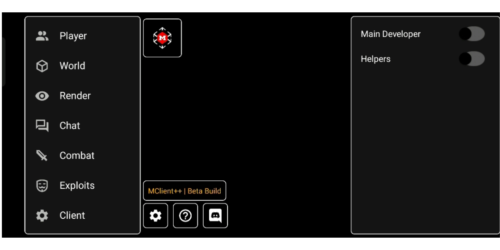

<h1 align="center">
  <br>
  <a href="https://mclient.tk"></a>
  <br>
  MClient++
  <br>
</h1>

<h4 align="center">A Minecraft PE Hacked client built for Anarchy servers it can also be used in Minigame Servers</a>.</h4>

[]()

## Main Features

* **KillAura**
* **CrystalAura**
* **Fly bypasses**
* **Infinite Time**
* **Smooth GUI**
* **Performance improving mods**

## Close Source Info
> We originally planned MClient++ to be ```Open Sourced``` but due to the fact that alot of people telling me they will skid MClient++
i decided to make this closed sourced, this did affect our playerbase as ```AntiVirus Softwares will flag it as a virus``` because it thinks that we are hiding something dangerous because we encrypted MClient++, MClient++ is 100% safe. we have over 17k downloads to confirm

## How To Use

> To install MClient++ please delete your original Toolbox For MCPE

## Supported Operating System

- [Android](https://www.android.com/intl/en_ph/)

**Note**
> We do not support iOS.

## Download

You can [download](https://github.com/MClientMCPE/MClientPlusPlus/releases/) here.

## GUI

## Credits

**Creators/Developers**

- [ToolDroid](https://m.youtube.com/@ToolDroidYT-Official?itct=CDMQoTAYACITCJi05uTxu_sCFdHjTAIdNhYM1w%3D%3D)

**Apps i used**

- [ApkEditorMaster](https://www.mediafire.com/file/kret3hpauekxcvs/ApkEditorMaster.apk/file)
- [NP Manager](https://wwk.lanzoue.com/i5gx90fufe6b)
- [MT Manager](https://mtmanager.co/)
- [VsCode](https://code.visualstudio.com/)
- [Android Studio](https://developer.android.com/studio?gclid=CjwKCAiAmuKbBhA2EiwAxQnt74l1Rc4mDHPQ4KR_DvT4mNRyUwX1S1UaIChfyshAfMbJESn2kMr8bhoC6F8QAvD_BwE&gclsrc=aw.ds)

## Support

> [Donate](https://dsc.gg/mclient)

## Links

> [MClient++ Discord](https://dsc.gg/mclient)
> [MClient++ Website](https://mclient.tk)
